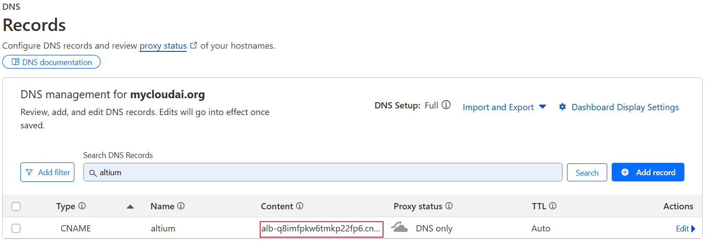

# cloudflare generate ssl


# aliyun create RAM user and access_key secret_key


# terraform
DOC: https://registry.terraform.io/providers/aliyun/alicloud/latest/docs

- ssl: cert generate from cloudflare
- data.tf: get needed data resource
- vpc.tf: create vpc, vswitch
- sg.tf: create security group
- key.tf: create key pair
- db.tf: create db ecs
- asg.tf: create autoscaling group, rule,alarm
- alb.tf: create alb, server group, listener

```
export TF_VAR_access_key='xxx'
export TF_VAR_secret_key='xxx'
export TF_VAR_allowed_ip_addresses='["10.0.0.0/8","16.0.0.0/8","149.0.0.0/8"]'

terraform init
terraform plan
terraform apply --auto-approve
```


generate key for debug ecs
```
terraform output private_key > private.key
```

# cloudflare create record


# validate web


# POC infrastructure
```
terraform graph | dot -Tsvg > image/terraform_graph.svg
```


